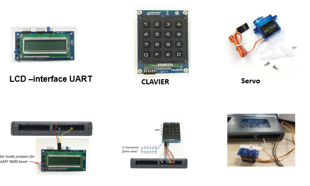
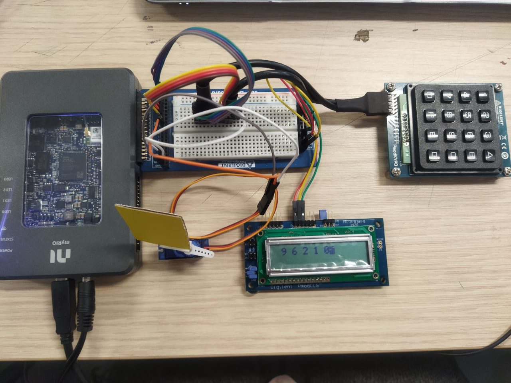
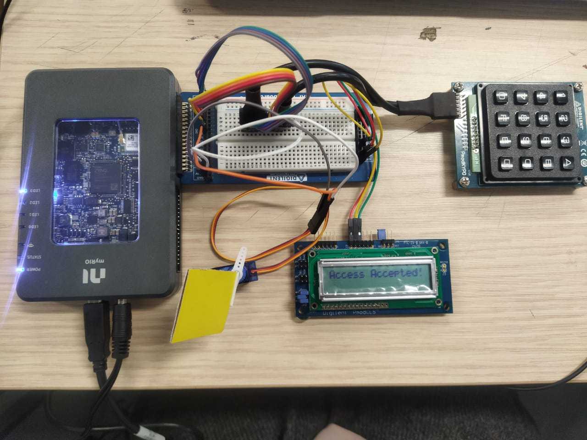
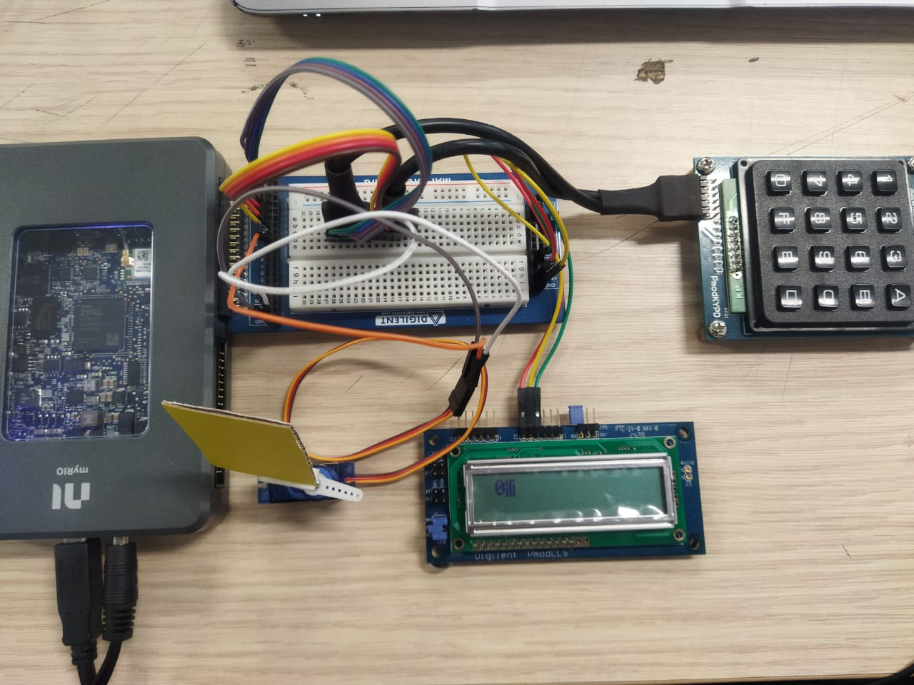

<h1 align="center">Safety deposit box using LabVIEW MyRIO.</h1>

<h1 align="center">Abstract</h1>
The objective of this project is to develop a safety deposit box using LabVIEW MyRIO, which enables users to store valuable items and secure them with a four-digit PIN code. The major challenge of this project involves designing a finite state machine to manage the different states of the safety deposit box, including "open," "locking in progress," "locked," and "openingin progress." To facilitate user interaction, the system features a keyboard and LCD display for entering the PIN code and displaying instructions and alerts in case of suspicious activities. Additionally, the safety deposit box controller incorporates a servo for locking and unlocking the box and a mode for resetting the code for a new client or in case the user forgets the code. The system is programmed using LabVIEW to monitor and control all components and ensure that the finite state machine detects only unique key presses. Furthermore, an LED indicator can be used to signify the locking status of the safety deposit box.

<h1 align="center">GENERAL INTRODUCTION</h1>

The MyRIO LabVIEW controller for hotel safes is a comprehensive solution for real-time control of hotel safes. This controller ensures the monitoring of safe conditions, generates activity reports, and interacts with safe users. The system can be configured to send alerts in case of suspicious activity or security vulnerabilities. It also enables simultaneous monitoring of multiple safes, making it an ideal solution for large hotel chains. The system is scalable and can be tailored to the specific needs of each hotel. It utilizes sensors to detect the safe's status, such as door opening or closing and the presence of an item inside. Lastly, the MyRIO LabVIEW controller for hotel safes provides a user-friendly interface for hotel guests, allowing them easy access to their safes through a PIN code.

<h1 align="center">Hardware</h1>

   

<h1 align="center">Project description</h1>
In the context of designing a hotel safe using LabVIEW MyRIO, several electronic components have been employed to create the system. These components include the LCD, the 4x4 keypad, the servo motor, the RFID reader, and two LEDs. Each of these components plays a crucial role in the operation and security of the safe. Step into our captivating project simulation, where we delve into the realm of a sophisticated electronic system designed to display an acceptance message upon correct code entry. Prepare to witness a mesmerizing spectacle as an LCD screen proudly exhibits "Accepted Access," accompanied by a servo motor executing a precise 180-degree rotation. To add to the intrigue, a radiant LED on our MyRIO platform will illuminate, indicating authorized access.
 However, don't be disheartened if the correct code eludes you on your initial attempt. Should this occur, the servo motor will remain stationary, and the LED will remain unlit. Fear not, for code redemption is within reach – simply press the dedicated "C" button to reset.
 Embark on this immersive journey, where technology dances to your input, and a world of electronic marvels awaits your exploration.

<h2>Access and Safe Unlocking</h2>
When a user wishes to register a code in the safe, they should input the combination "1234" to unlock it. After entering the code, they need to press the "A" button to confirm. If the code is accurate, the safe will open, a LED on the MyRIO platform will illuminate, and the servo motor will perform a precise 180-degree rotation. Below is the demonstration image:

   

Feel the thrill of successful access and experience the safe's mechanisms in action. Your interaction sets the stage for a symphony of electronic precision and functionality.

<h2>Unauthorized Access Attempt</h2>
When a user attempts to register a code in the safe, they should input the combination "1234" to unlock it. After entering the code, they need to press the "A" button to confirm. If the code is incorrect, nothing will occur: the safe will remain closed, the LED on the MyRIO platform will remain off, and the servo motor will not rotate. This signifies that access to the safe is denied until the correct code is accurately entered. Below is the demonstration image:

   

Witness the safeguarding mechanisms in action as they thwart unauthorized entry attempts, ensuring the security of the contents within the safe. Your interaction serves as a testament to the system's vigilant protection.
<h2></h2>

<h2>Code Reset</h2>
In the event of an error during code entry, the user can reset the code by pressing the "C" button. This action will enable them to initiate the code entry process anew. Below is the demonstration image:

   

Experience the convenience and flexibility of the code reset feature, which ensures that users can correct their input errors and start afresh without any complications. Your control over the system grants you the power to rectify and restart the process effortlessly.

<h1 align="center">Simulation</h1>

https://github.com/hsaine/LabVIEW_MyRIO/assets/85867562/e0877c03-f5da-4ccc-b92f-3f1bad1794c5

<h1 align="center">GENERAL CONCLUSION</h1>
In conclusion, the MyRIO LabVIEW controller for hotel safes stands as an exceptional achievement that brings numerous benefits to both hotel establishments and their clients. This comprehensive solution offers real-time control of safes, ensuring the security of guests' belongings and providing peace of mind for hoteliers. With its advanced monitoring capabilities, activity report generation, and user-friendly interaction, this controller guarantees a high level of security and comfort. Its flexibility and scalability enable it to adapt to the specific needs of each hotel, regardless of size or location.

The use of sensors to detect the safe's status, such as door opening or closing, as well as the presence of items inside, further enhances the security provided by this system. Moreover, the intuitive user interface based on a PIN code allows guests easy access to their safes, thus simplifying their hotel experience.

In essence, the MyRIO LabVIEW controller for hotel safes represents a significant advancement in the management of guest property security. It enhances the reputation of hotel establishments as safe and reliable destinations for travelers. With this comprehensive solution, hotels can offer their guests a secure and pleasant experience, thereby reinforcing their satisfaction and loyalty.

<h1 align="center">Team</h1>
<ul>
	<li> Ayoub Hsaine</li>
	<li>Ilhame Soufi </li>
	<li>Chaimae Dehhani </li>
</ul>
